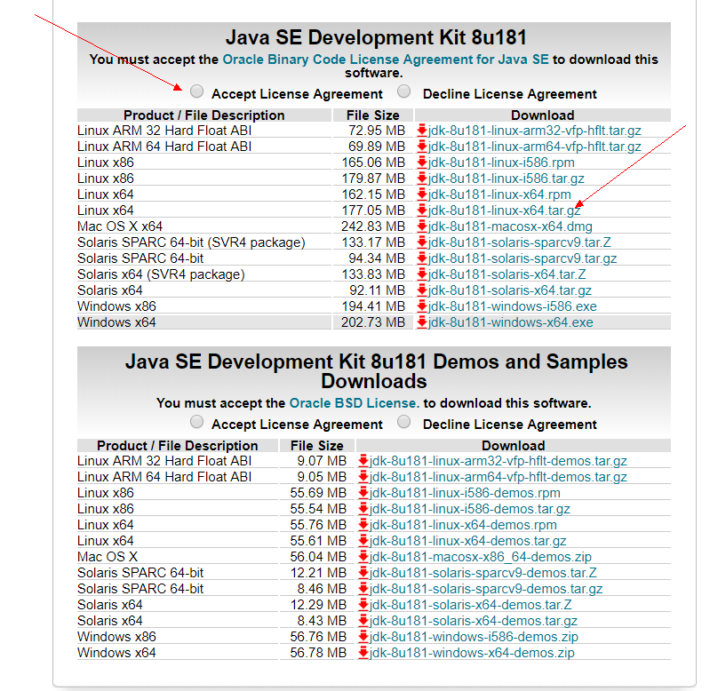

## Linux下安装jdk


### 一、查看操作系统信息

我们在Centos7下进行操作。运行命令查看操作系统版本和cpu信息。

#### 1.1 查看Linux版本信息

```
lsg_release -a
```

>
LSB Version:    :core-4.1-amd64:core-4.1-noarch <br/>
Distributor ID: CentOS </br>
Description:    CentOS Linux release 7.4.1708 (Core) </br>
Release:    7.4.1708 <br/>
Codename:   Core <br/>


#### 1.2 查看cpu信息

```
uname -a
```

>
Linux iZj6cf6x67njae75u07qsdZ 3.10.0-693.2.2.el7.x86_64 #1 SMP Tue Sep 12 22:26:13 UTC 2017 x86_64 x86_64 x86_64 GNU/Linux

如果出现 **x86_64** 说明是64位，如果出现 **i686** 说明是32位的.

### 二、下载jdk并配置环境变量


#### 2.1 下载jdk
我们去[官网](http://www.oracle.com/technetwork/java/javase/downloads/jdk8-downloads-2133151.html)找到1.8版本，接受Licence并找到Linux64版本.



进入要安装jdk文件的目录，运行下面下载命令。

```
wget --no-check-certificate --no-cookies --header "Cookie: oraclelicense=accept-securebackup-cookie" http://download.oracle.com/otn-pub/java/jdk/8u181-b13/96a7b8442fe848ef90c96a2fad6ed6d1/jdk-8u181-linux-x64.tar.gz
```

**说明 **

* 由于下载jdk需要同意License,所以在Linux下载时不能直接 **wget 地址** ,需要加上一些参数。
* 如果想要下载其他版本，直接修改http之后的地址即可。
* 也可以在windows下载后上传到Linux。

#### 2.2 解压

```
tar -zxvf jdk-8u181-linux-x64.tar.gz 
```

#### 2.3 配置环境变量

```
vim /etc/profile
```

增加以下配置内容

```
#set java environment
JAVA_HOME=/usr/src/java/jdk1.8.0_181
CLASSPATH=$JAVA_HOME/lib
PATH=$PATH:$JAVA_HOME/bin
export PATH JAVA_HOME CLASSPATH
```

使配置文件生效

```
source /etc/profile
```

### 三、安装成功

运行 **java** 和 **javac**，如果出现Java命令信息表示成功。

```
java

javac
```

---

--完--