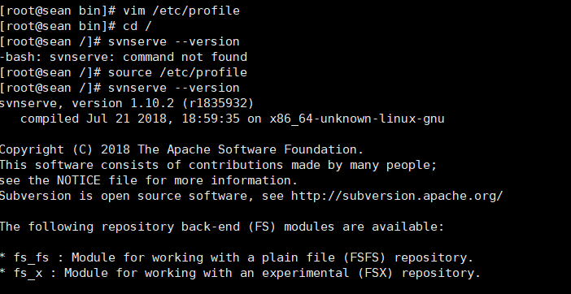

### Linux搭建svn服务

>[参考文章1](http://www.linuxfromscratch.org/blfs/view/svn/general/subversion.html)


#### 一、安装svn 

如果使用centos自带的安装包，直接运行下面命令即可安装

```
yum install -y subversion
```
 
下面讲解通过源代码编译安装。

##### 1.1 下载
进入要安装的目录，运行以下命令.以1.10.2版本为例，如果想安装其他版本请到[官网](http://subversion.apache.org/download/)找到版本地址替换下面url即可。

```
wget http://mirrors.hust.edu.cn/apache/subversion/subversion-1.10.2.tar.gz
```
 
##### 1.2解压

```
tar xfvz subversion-1.10.2.tar.gz
```

#### 1.3编译

编译之前要安装gcc和gcc++编译器，如果没有的话运行下面命令安装

```
yum -y install gcc gcc-c++
```

进入subversion解压后的目录，依次运行下面的命令先配置，再编译安装

```
cd subversion-1.10.2 //进入解压后目录

./configure --prefix=/opt/subversion  //配置编译路径，使用默认
```

运行上面命令如果报错apr包没找到，则需要安装apr包


>新建apr目录，去[官网](http://apr.apache.org/download.cgi)下载apr包并解压编译安装

```
wget http://mirrors.tuna.tsinghua.edu.cn/apache//apr/apr-1.6.3.tar.gz //下载

tar xfvz apr-1.6.3.tar.gz //解压

./configure --prefix=/usr/local/apr

make && make install
//
```

如果提示apr-util包没找到，安装apr-util包

>apr-util安装

```
mkdir apr-util
cd apr-util

wget http://mirrors.tuna.tsinghua.edu.cn/apache//apr/apr-util-1.6.1.tar.gz

tar xfvz apr-util-1.6.1.tar.gz 

cd apr-util-1.6.1

./configure --prefix=/usr/local/apr-util --with-apr=/usr/local/apr

make && make install
```

>安装apr-util如果出现下面的错，则需要安装expat

```
yum install -y expat-devel
```

>回到svn目录,运行

```
./configure --prefix=/opt/subversion --with-apr-util=/usr/local/apr-util
```

报错 **configure: error: Subversion requires SQLite**

>安装sqlite

```
mkdir sqlite

cd sqlite

wget https://www.sqlite.org/sqlite-amalgamation-3.6.13.tar.gz
```

>svn

```
mkdir sqlite-amalgamation

cd sqlite-amalgamation/

cp /usr/src/svn/sqlite/sqlite-3.6.13/sqlite3.c ./
cp /usr/src/svn/sqlite/sqlite-amalgamation-3081101/sqlite3.c ./

```

```
wget https://www.sqlite.org/2015/sqlite-amalgamation-3081101.zip

```


>安装zlip

```
wget http://zlib.net/zlib-1.2.11.tar.gz

tar xfvz zlib-1.2.11.tar.gz

./configure --prefix=/usr/local/zlib

make && make install

cd /usr/local/

ln -s zlib-1.2.11 zlib

```

>svn

```
./configure --prefix=/opt/subversion --with-apr-util=/usr/local/apr-util --with-zlib=/usr/local/zlib --with-lz4=internal

```

>报错configure: error: Subversion requires UTF8PROC

```
mkdir utf8proc

cd utf8proc

wget http://springdale.math.ias.edu/data/puias/computational/7/x86_64//utf8proc-1.2-1.sdl7.x86_64.rpm

yum install utf8proc-1.2-1.sdl7.x86_64.rpm
```

>svn

```
./configure --prefix=/opt/subversion --with-apr-util=/usr/local/apr-util --with-zlib=/usr/local/zlib --with-lz4=internal --with-utf8proc=internal

make && make install
```

##### 1.4环境变量配置

```
vim /etc/profile

添加内容
export PATH=$PATH:/opt/subversion/bin

source /etc/profile

svnserve --version//如果出现版本说明成功
```



#### 二、配置仓库

##### 2.1 新建仓库目录

```
mkdir -p /home/svn/repository //新建目录

svnadmin create /home/svn/repository/  //修改为svn仓库
```

进入此仓库，可以看到目录结构


##### 2.2 配置文件

根据情况修改配置文件，先进入conf目录

```
cd conf

vim svnserve.conf //如果需要请修改相关配置

vim passwd //这里修改帐号密码
```


>修改权限文件，赋予harry权限

```
vim authz
```


...

配置等待抽空补充

#### 三、启动服务


